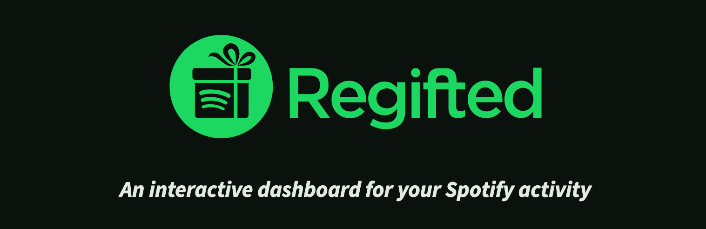
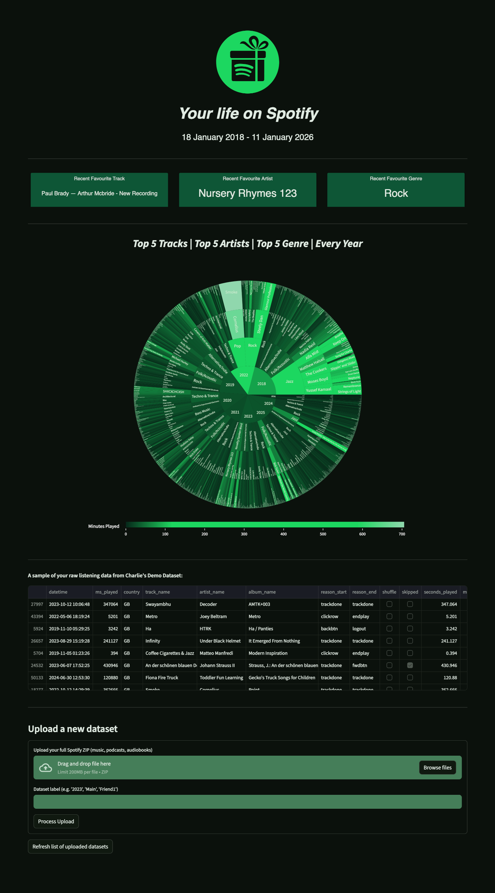
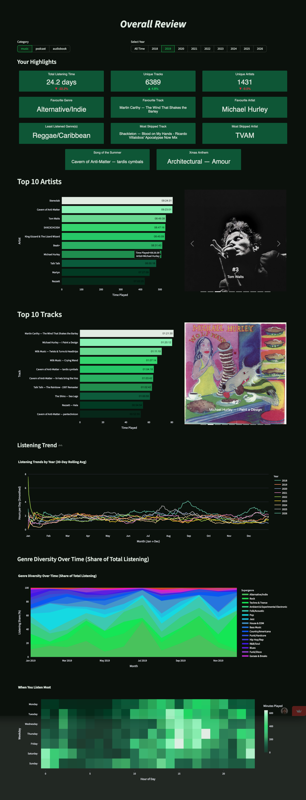
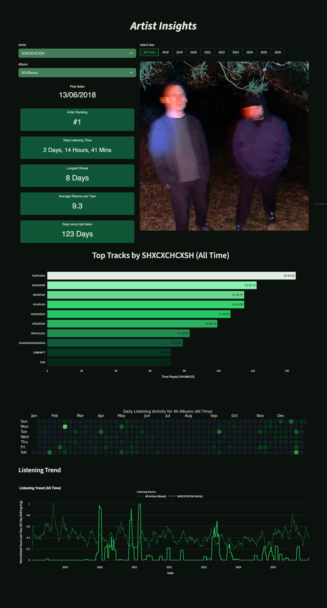
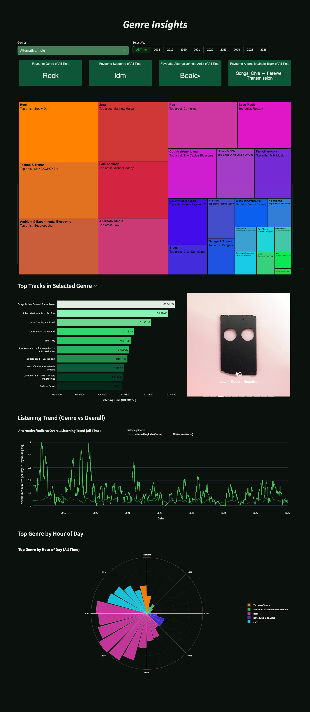
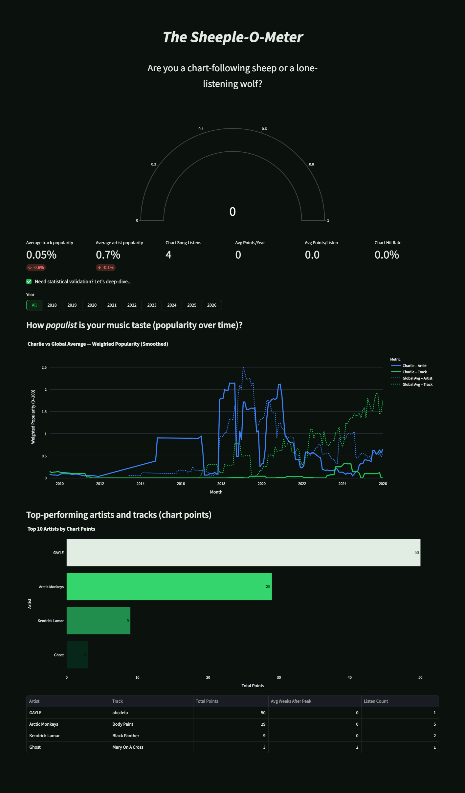
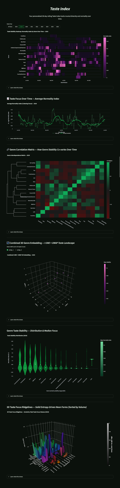
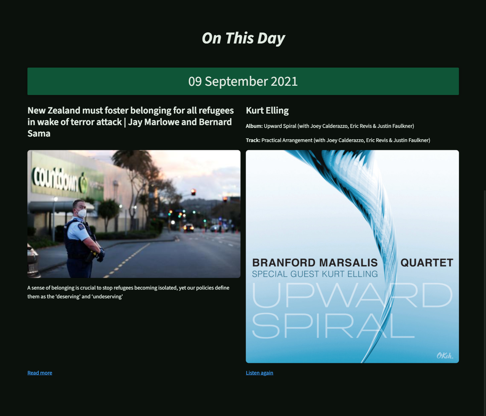

# Spotify Regifted

A cloud-hosted Streamlit app for exploring, enriching, and visualising personal Spotify listening history.

Spotify Regifted turns a user's Spotify Extended Streaming History into a detailed personal analytics dashboard: part music diary, part data exploration tool, part playful alternative to Spotify Wrapped.

Try it [here](https://spotify-regifted.streamlit.app/).



---

## Table of Contents

- [Overview](#overview)
- [How to Use the App](#how-to-use-the-app)
- [Project Background](#project-background)
- [Technical Design](#technical-design)
- [Architecture and Data Flow](#architecture-and-data-flow)
- [App Pages](#app-pages)
- [Analytical Methods](#analytical-methods)
- [Data Sources](#data-sources)
- [Backend and Storage](#backend-and-storage)
- [Major Files](#major-files)
- [Design Challenges and Trade-offs](#design-challenges-and-trade-offs)
- [Deployment](#deployment)
- [Logging and Debugging](#logging-and-debugging)
- [Known Limitations and Future Improvements](#known-limitations-and-future-improvements)
- [Screenshots](#screenshots)

---

## Overview

Spotify Regifted is a cloud-hosted Streamlit app that turns a user’s Spotify Extended Streaming History into an interactive personal listening dashboard.

The app is designed as a richer, more exploratory alternative to Spotify Wrapped. Instead of only showing a small set of end-of-year highlights, Spotify Regifted lets users upload their full listening history and explore their habits across years of music, podcasts, and audiobooks.

Users can discover their most-played artists, tracks, genres, albums, podcasts, and audiobooks, but the app goes further than simple top-ten lists. It looks at listening trends over time, genre shifts, artist obsessions, skip behaviour, time-of-day patterns, chart awareness, popularity, and rolling changes in musical focus.

The app is intended to be fun and accessible for everyday Spotify users. Someone should be able to upload their Spotify data and quickly answer questions like:

- Which artists have I returned to the most over the years?
- What genres quietly took over different periods of my life?
- Am I more mainstream or obscure than I thought?
- Did I listen to chart hits while they were actually popular?
- When did I first discover my favourite artists?
- Which albums or tracks defined different years?
- What was I listening to on a specific date?

Behind the user-facing dashboard is a larger technical system. The app cleans and stores Spotify exports, enriches them with metadata from external APIs, maintains reusable metadata tables, generates custom popularity and chart-scoring metrics, repairs missing genre labels with AI assistance, and creates cached statistical outputs for deeper analysis.

The project is therefore both a user-facing music analytics app and a technical portfolio project. It demonstrates exploratory data analysis, Python data processing, Streamlit dashboard design, cloud storage, lightweight database design, API integration, background enrichment, metadata modelling, custom metric engineering, and practical deployment trade-offs.

At a high level, Spotify Regifted does five things:

| Step | Description |
|---|---|
| Upload | Users upload their Spotify Extended Streaming History ZIP. |
| Clean | The raw Spotify JSON files are extracted, standardised, and stored as a usable listening-history dataset. |
| Analyse | The app immediately generates core listening summaries, trends, rankings, and visualisations. |
| Enrich | Background jobs add artist images, album artwork, genres, popularity scores, chart scores, and missing metadata. |
| Explore | Users navigate pages covering overall listening, artists, genres, popularity, Taste Index, and On This Day features. |

The current version runs publicly on Streamlit Cloud and uses Cloudflare D1 and Cloudflare R2 for backend storage. It was built to run on free or low-cost cloud services, which shaped many of the architectural decisions and trade-offs described later in this README.

[Back To Top](#spotify-regifted)

## How to Use the App

Spotify Regifted uses your Spotify Extended Streaming History. This is different from the smaller account data export that Spotify can provide more quickly. The Extended Streaming History export contains the detailed listening records needed for the app’s long-term analysis.

### 1. Request your Spotify data

Go to your Spotify privacy/account settings and request your **Extended Streaming History**.

Spotify may take some time to prepare this export. When it is ready, Spotify will email you a download link.


### 2. Download the ZIP file

Download the ZIP file from Spotify when it arrives.

You do not need to manually edit the files inside the ZIP. Spotify Regifted is designed to accept the ZIP directly.

### 3. Create an account or log in

Open [Spotify Regifted](https://spotify-regifted.streamlit.app/) and create an account, or log in if you already have one.

The account system lets the app keep your uploaded datasets separate from other users’ datasets.

### 4. Upload your Spotify ZIP

Use the upload form on the Home page to upload the Spotify ZIP file.

Give the dataset a clear label, such as:

- `main-history`
- `spotify-full-export`
- `2025-export`
- `my-listening-history`

Dataset labels make it easier to identify different uploads later.

### 5. Explore the basic dashboard

After upload, the app cleans the raw Spotify files and stores the resulting listening-history dataset.

Once this first processing step has finished, you can immediately explore the basic dashboard pages. These include top artists, top tracks, listening trends, listening heatmaps, music/podcast/audiobook summaries, and other analysis that can be calculated directly from the cleaned Spotify export.

### 6. Wait for enrichment to complete

Some richer features require background enrichment. This process fetches extra metadata from external sources, including Spotify, Discogs, chart-reference data, and AI-assisted genre repair.

Enrichment adds features such as:

- artist images
- album artwork
- artist genres
- supergenres
- Spotify popularity scores
- chart scoring
- podcast/show metadata
- audiobook metadata
- Taste Index outputs

The app can be used before enrichment is fully complete, but some pages will become richer as more metadata is collected.

### 7. Revisit the app later

Because enrichment can take time, especially for large listening histories, the best experience may come after returning to the app later. Once enrichment has completed, pages such as Genres, Popularity, Artists, and Taste Index will have more complete metadata and visualisations.

### What to upload

Upload the ZIP file provided by Spotify for your Extended Streaming History.

Do not upload:

- a single edited CSV
- screenshots from Spotify Wrapped
- the smaller basic account export
- individual JSON files removed from the ZIP
- unrelated Spotify playlist exports

### Data privacy note

Spotify Regifted uses accounts so that uploaded datasets are associated with the correct user. The app stores cleaned listening-history data and enrichment outputs in Cloudflare-backed storage.

The app is designed for personal listening analysis. Users should only upload their own Spotify export, or a dataset they have permission to analyse.

[Back To Top](#spotify-regifted)

## Project Background

Spotify Regifted began as a collaborative final project for a data analytics course, built with Banjamin Garalnick, Jana Huepe, and Thomas Witt.

The original version was a much smaller local dashboard. It ran on one of our computers, used a simple clean-and-transform process, and allowed us to explore Spotify listening history through a Streamlit interface. At that stage, the project was not designed for public deployment, user accounts, cloud storage, metadata enrichment, or long-running background processing.

After the course finished, I continued developing the project substantially beyond the original scope. The current version is no longer just a local dashboard. It is a cloud-hosted analytics app with user authentication, uploaded datasets, Cloudflare-backed storage, external API enrichment, custom scoring models, AI-assisted genre repair, cached analytical outputs, and a much wider set of visual pages.

The project has therefore had two lives:

| Stage | Description |
|---|---|
| Course project | A collaborative local Streamlit dashboard for exploring Spotify listening history after a simple cleaning process. |
| Extended solo development | A public cloud-hosted analytics product with persistent user data, enrichment, genre modelling, popularity scoring, chart ingestion, statistical taste analysis, and deployment-focused backend design. |

This history explains some of the current architecture. The project grew organically from an exploratory analytics exercise into a much more ambitious application. Some parts of the codebase still reflect that evolution, including large multi-purpose files and older infrastructure paths that should eventually be cleaned up.

The benefit of that growth is that the app now demonstrates a much broader set of skills than the original course brief required. It combines exploratory data analysis, Python data processing, interactive dashboard design, API integration, background enrichment, cloud object storage, lightweight relational state, custom metric design, and practical deployment trade-offs.

The aim of the current project is not only to show what someone listened to on Spotify, but to turn a long-term listening history into a detailed personal data product: part dashboard, part music diary, part behavioural analysis, and part playful alternative to Spotify Wrapped.

[Back To Top](#spotify-regifted)

## Technical Design

Spotify Regifted was designed to sit between two audiences.

For everyday Spotify users, the app needs to feel playful, visual, and easy to understand. Users should be able to upload their Spotify history and quickly discover things about their listening behaviour without needing to understand data engineering, APIs, file formats, or statistical methods.

For technical reviewers and recruiters, the project is intended to demonstrate practical data analysis, Python engineering, cloud deployment, API integration, data modelling, feature engineering, and interactive dashboard design.

The result is an analytics-focused Streamlit application with a lightweight cloud backend and a large amount of Python-based processing behind the scenes.

### Design Goals

The main design goals were:

| Goal | Design response |
|---|---|
| Make Spotify history explorable for non-technical users | Build an interactive Streamlit dashboard with clear summaries, visualisations, and playful metrics. |
| Go beyond Spotify Wrapped | Analyse full Extended Streaming History rather than only recent or high-level listening trends. |
| Support public deployment | Move from a local dashboard to Streamlit Cloud with Cloudflare-backed persistence. |
| Keep costs low | Use free or low-cost hosted services rather than paid infrastructure. |
| Enrich raw listening data | Add metadata, artwork, genres, popularity, chart data, and statistical outputs from external APIs. |
| Keep the app usable after upload | Show basic analysis immediately, then run slower enrichment in the background. |
| Demonstrate analytical depth | Include custom metrics such as chart scoring, Taste Index, genre similarity, and rolling listening statistics. |

### Tech Stack

| Area | Technology / Method | Purpose |
|---|---|---|
| App framework | Streamlit | Interactive web app and dashboard UI. |
| Deployment | Streamlit Cloud | Public hosting for the app. |
| Data processing | Python, pandas | Cleaning, transformation, aggregation, feature engineering, and metadata joins. |
| Visualisation | Plotly, Streamlit components | Interactive charts, scorecards, heatmaps, treemaps, gauges, and 3D views. |
| Object storage | Cloudflare R2 | Cleaned datasets, metadata tables, reference files, logs, checkpoints, and cached outputs. |
| Relational database | Cloudflare D1 | User accounts, login events, upload events, and enrichment status. |
| Storage abstraction | DAO layer | Separates app/enrichment logic from storage backend details. |
| Metadata enrichment | Spotify Web API | Artist, album, track, show, audiobook, image, ID, and popularity metadata. |
| Genre fallback | Discogs API | Additional artist genre/style metadata when Spotify genres are missing. |
| AI-assisted repair | Gemini API | Missing genre classification and supergenre taxonomy repair. |
| Chart reference data | Official Charts | UK chart history used for popularity scoring. |
| News context | Guardian Content API | Historical headlines for the On This Day feature. |
| Statistical analysis | scipy, scikit-learn, UMAP/t-SNE | Taste Index, rolling-window statistics, genre similarity, and dimensionality reduction. |

### Streamlit as the Application Layer

Streamlit was chosen because it allows data apps to be built quickly in Python without needing a separate frontend framework. This made it well suited to the original course-project version of the app and remained useful as the project expanded.

In the current app, Streamlit handles:

- login and session state
- dataset upload
- dataset selection
- page navigation
- chart rendering
- user-facing explanatory text
- enrichment status display
- loading cached analytical artefacts

The main advantage is speed of development. The same Python environment can handle data processing, UI rendering, chart creation, and user interactions.

The trade-off is that Streamlit is not ideal for long-running background jobs. Metadata enrichment therefore requires extra machinery around threads, locks, status records, checkpoints, and recovery logic.

### Cloudflare as the Backend

The app uses Cloudflare D1 and Cloudflare R2 as a lightweight backend.

D1 handles small structured application records, such as users and upload events. R2 stores larger analytical artefacts, such as user datasets, metadata tables, logs, and parquet outputs.

This split keeps the backend cheap and relatively simple:

```text
Cloudflare D1
  -> small relational app state

Cloudflare R2
  -> larger analytical files and cached outputs
```

This architecture is not as fully featured as a dedicated application backend with a worker queue and analytical database, but it allowed the project to become publicly deployable without significant infrastructure cost.

### DAO-Based Storage Access

The DAO layer is used to keep the rest of the app from depending directly on the details of Cloudflare storage.

Instead of writing R2 or D1 operations throughout the Streamlit pages, the app uses DAO methods for actions such as:

- saving user datasets
- listing available datasets
- loading metadata tables
- merging new metadata rows
- writing status updates
- saving logs
- reading cached parquet outputs

This is useful because the app has evolved through several storage designs. The DAO layer made it easier to move towards the current Cloudflare-backed architecture while retaining a local development path.

### Background Enrichment Design

The raw Spotify export is not enough to power the full app. It needs to be enriched with metadata from Spotify, Discogs, Gemini, chart data, and other sources.

The enrichment design follows a progressive model:

```text
Upload cleaned Spotify history
  |
  v
Show basic dashboard immediately
  |
  v
Run standard enrichment in the background
  |
  v
Unlock richer metadata and artwork
  |
  v
Run deeper enrichment and cached analytical outputs
  |
  v
Unlock Popularity, chart scoring, Taste Index, and richer genre analysis
```

This approach avoids making users wait for every API call before they can use the app. It also makes enrichment recoverable: partial results can be saved, merged, logged, and resumed.

### Priority-Based Enrichment

The enrichment process is intentionally prioritised. The app enriches the most visible and useful records first rather than trying to process the entire listening history in a single pass.

Priority examples include:

- top overall artists
- top yearly artists
- top podcasts and audiobooks
- most important albums
- tracks needed for popularity analysis
- artists needed for genre pages
- records required for chart scoring and Taste Index outputs

This gives the user a better experience because the most visible dashboard sections improve first. The downside is that enrichment logic is more complex than a simple one-shot batch job.

### Cached Analytical Outputs

Some analysis is too expensive or slow to calculate every time a user opens a page. The app therefore generates certain outputs during enrichment and stores them as cached parquet files in R2.

Examples include:

| Cached output | Used by |
|---|---|
| Chart scorer parquet | Popularity page |
| Global chart summaries | Popularity comparisons |
| Taste Index rolling parquet | Taste Index page |

This keeps page rendering faster and avoids repeating expensive calculations. It also gives the app a clearer separation between background feature generation and foreground dashboard rendering.

### Custom Metrics and Interpretability

Several metrics in the app are deliberately custom-built rather than standard industry metrics.

Examples include:

- Sheeple-O-Meter
- chart hit rate
- chart points
- Taste Index
- Taste Focus Index
- genre stability/focus views

The aim is not to create definitive scientific measures of musical taste. The aim is to create understandable, playful, and reasonably grounded metrics that help users see their listening behaviour from new angles.

This is why the metrics are designed to be explainable. For example, the chart score uses a simple peak-position and time-decay model, while the Taste Index is shown through rolling windows, heatmaps, distributions, and genre-level trends.

### Analytical Design Philosophy

The app is built around exploratory analysis rather than prediction.

It does not try to recommend music or classify users into fixed personality types. Instead, it asks questions like:

- What did this user listen to most?
- How did their taste change over time?
- Which genres dominated different periods?
- Did they listen mostly to mainstream or obscure music?
- Did they discover chart hits while they were current?
- Did they go through focused genre obsessions or broad exploratory phases?
- What were they listening to on memorable dates?

This makes the app closer to a personal listening-history investigation than a conventional BI dashboard.

### Technical Design Summary

In short, Spotify Regifted is designed as:

```text
A Streamlit Cloud analytics app
  + Cloudflare D1/R2 backend
  + DAO storage abstraction
  + Spotify/Discogs/Gemini/Guardian/Chart integrations
  + background metadata enrichment
  + cached analytical parquet outputs
  + interactive Plotly visualisations
  + custom popularity, genre, and taste-profile metrics
```

The architecture is pragmatic rather than perfect. It allowed the project to move from a local course dashboard into a public cloud-hosted app while still demonstrating a broad range of data analysis, API integration, backend storage, and visualisation skills.

[Back To Top](#spotify-regifted)

## Architecture and Data Flow

Spotify Regifted is designed as a cloud-hosted Streamlit application with a lightweight backend built around Cloudflare D1 and Cloudflare R2. The app is not a traditional scheduled data pipeline. Instead, it behaves more like an interactive analytics product: a user uploads their Spotify data, the app cleans and stores it, and background enrichment jobs gradually add metadata, artwork, genres, popularity scores, chart scores, and cached statistical outputs.

The central design goal is that users should be able to explore their listening history immediately after upload, even before all enrichment has finished. Basic dashboard pages can run from the cleaned Spotify export alone, while richer pages become more complete as background metadata jobs finish.

```text
User
  |
  v
Streamlit Cloud App
  |
  |-- Authentication
  |-- ZIP upload
  |-- Dataset selection
  |-- Page navigation
  |-- Dashboard rendering
  |-- Enrichment status display
  |
  v
DAO Layer
  |
  |-------------------------------|
  |                               |
  v                               v
Cloudflare D1                  Cloudflare R2
- user accounts                 - cleaned listening datasets
- login events                  - master metadata tables
- upload events                 - reference datasets
- enrichment status mirror      - enrichment logs
                                - checkpoints
                                - status JSON files
                                - chart scorer parquet outputs
                                - Taste Index parquet outputs

External APIs and Reference Sources
  |
  |-- Spotify Web API      -> artist, album, track, show, audiobook, artwork, and popularity metadata
  |-- Discogs API          -> fallback artist genre/style metadata
  |-- Gemini API           -> AI-assisted missing genre repair and taxonomy mapping
  |-- Official Charts      -> UK chart reference data for popularity scoring
  |-- Guardian Content API -> historical headlines for the On This Day feature
```

### Upload-to-dashboard flow

When a user uploads their Spotify Extended Streaming History ZIP, the app extracts the raw streaming-history JSON files, cleans and standardises the data, then saves the resulting listening-history dataset to Cloudflare R2. Once this first transformation is complete, the user can immediately begin exploring the app.

```text
1. User uploads Spotify Extended Streaming History ZIP.

2. Streamlit extracts the raw Spotify JSON files.

3. Python/pandas cleaning logic standardises the listening history into a usable dataframe.

4. The cleaned dataset is saved to Cloudflare R2.

5. The app records the upload event and dataset status through Cloudflare D1.

6. The user can immediately explore basic dashboard pages.

7. Background enrichment starts.

8. Enrichment jobs call Spotify, Discogs, Gemini, and chart-reference processes.

9. Metadata tables, logs, checkpoints, chart scores, and Taste Index outputs are written back to Cloudflare R2.

10. Streamlit pages combine the cleaned user history with enriched metadata and cached analytical outputs.
```

This means the app has two levels of analysis:

| Level | Available When | Description |
|---|---|---|
| Core listening analysis | Immediately after upload | Uses the cleaned Spotify export to show listening totals, top artists, top tracks, time trends, heatmaps, and basic behavioural summaries. |
| Enriched analysis | After background enrichment | Adds artist images, album artwork, genres, supergenres, Spotify popularity, chart scoring, missing genre repair, Taste Index outputs, and richer visualisations. |

### Why the app uses background enrichment

Spotify’s raw export is useful, but it does not contain enough metadata to power the full app. It may include the track, artist, timestamp, play duration, and some Spotify URIs, but it does not reliably provide everything needed for artwork, genre analysis, popularity scoring, album metadata, podcast/show enrichment, or deeper statistical features.

To solve this, Spotify Regifted runs a background enrichment process after upload. This enrichment process does several things:

- resolves Spotify IDs for artists, tracks, albums, shows, episodes, audiobooks, and chapters
- fetches metadata and artwork from the Spotify Web API
- fetches fallback artist genre information from Discogs
- places unresolved artists into an unlisted metadata table
- uses Gemini to repair missing genre labels and extend the subgenre-to-supergenre dictionary
- updates shared metadata tables in R2
- generates chart-scoring parquet files for the Popularity page
- generates rolling Taste Index parquet files for the Taste Index page
- writes logs, checkpoints, and progress status throughout the run

This design keeps the first user experience relatively quick while allowing slower metadata jobs to continue in the background.

### Storage design

The app separates small relational application state from larger analytical files.

Cloudflare D1 is used for lightweight relational records:

| D1 record type | Purpose |
|---|---|
| User accounts | Stores registered users and hashed credentials. |
| Login events | Records logins for basic app activity tracking. |
| Upload events | Records dataset uploads. |
| Enrichment status | Mirrors the current enrichment state so the UI can show progress. |

Cloudflare R2 is used for larger object storage:

| R2 object type | Purpose |
|---|---|
| Cleaned user datasets | Stores uploaded and cleaned Spotify listening histories. |
| Master metadata tables | Stores reusable artist, album, track, show, audiobook, and genre metadata. |
| Reference datasets | Stores chart data and supergenre mappings. |
| Status JSON files | Stores detailed enrichment status records. |
| Logs | Stores debug and enrichment activity logs. |
| Checkpoints | Stores partial enrichment progress for long-running jobs. |
| Parquet outputs | Stores chart scorer and Taste Index analytical outputs. |

This split keeps D1 focused on structured application state, while R2 handles larger analytical artefacts that are better suited to object storage.

### Role of the DAO layer

The app uses a DAO layer to keep the Streamlit interface separate from the storage backend. Rather than writing directly to D1 or R2 throughout the UI code, the app calls DAO methods for common operations such as:

- listing a user’s datasets
- loading a selected dataset
- saving cleaned listening history
- reading and merging metadata tables
- writing enrichment status
- writing logs
- storing checkpoints
- loading cached parquet outputs

This made it easier to move the project from earlier local/cloud storage experiments into the current Cloudflare-backed deployment. A local mode is still retained for development and testing, but the deployed app is designed around Cloudflare D1 and R2.

### Enrichment lifecycle

The enrichment process is deliberately phased. Instead of trying to enrich every possible artist, album, track, show, and audiobook in one flat pass, the app prioritises the metadata most likely to improve the visible dashboard first.

```text
Initial upload
  |
  v
Standard enrichment
  |
  |-- top overall artists, shows, and audiobooks
  |-- top entities per year
  |-- key albums and tracks
  |-- Spotify popularity metadata
  |-- chart scorer outputs
  |
  v
Standard enrichment complete
  |
  v
Breadth-first enrichment
  |
  |-- wider artist coverage
  |-- wider album coverage
  |-- additional show/audiobook metadata
  |-- missing genre detection
  |
  v
Deeper analytical outputs
  |
  |-- Taste Index parquet
  |-- repaired genre metadata
  |-- richer visualisations
```

This priority-based approach is a compromise. It gives users useful results earlier, but it also means the app has to manage status tracking, partial results, retries, checkpoints, and occasional recovery from stale or interrupted enrichment jobs.

### Current architecture in one sentence

Spotify Regifted is a Streamlit Cloud analytics app that stores user data and analytical artefacts in Cloudflare, enriches Spotify exports through several external APIs, and progressively turns raw listening history into interactive dashboards, custom popularity metrics, genre analysis, and rolling statistical taste profiles.

[Back To Top](#spotify-regifted)

## App Pages

Spotify Regifted is organised as a set of dashboard pages, each looking at the user’s listening history from a different angle. Some pages work mostly from the cleaned Spotify export, while others depend on enriched metadata, artwork, genre labels, chart scores, or cached statistical outputs.

| Page | Main purpose |
|---|---|
| [Home](#home)| Upload and select datasets, preview listening history, and start exploration. |
| [Overall Review](#overall-review) | Summarise music, podcasts, and audiobooks across the whole dataset. |
| [Artists](#artists)| Explore individual artists and albums in detail. |
| [Genres](#genres)| Analyse listening through genres and broader supergenres. |
| [Popularity](#popularity)| Estimate how mainstream, obscure, or chart-aware the user’s listening is. |
| [Taste Index](#taste-index)| Analyse rolling genre focus, stability, diversity, and similarity over time. |
| [On This Day](#on-this-day)| Pair a specific listening date with historical news context. |

### Home

The Home page is the entry point into the app. It handles the upload flow, dataset selection, and first high-level preview of a user’s Spotify history.

After logging in, users can upload their Spotify Extended Streaming History ZIP file and assign it a dataset label. The app extracts the raw Spotify JSON files, cleans the listening history, stores the cleaned dataset, and makes it available for analysis.

The Home page also shows a quick summary of the selected dataset, including:

- the listening-history date range
- recently played favourites
- a preview of the cleaned listening data
- a year-by-year genre, artist, and track sunburst
- enrichment status information

The sunburst chart is designed as an immediate visual overview of how a user’s listening changes over time. It groups each year into top genres, then top artists, then top tracks, giving users a quick way to see which sounds and artists dominated different periods.

The Home page is important because it supports the app’s progressive loading model: users can begin exploring basic analysis immediately after upload, while slower enrichment jobs continue in the background.

[Back To Page Index](#app-pages)

### Overall Review

The Overall Review page gives the broadest summary of the user’s listening history. It is designed to feel like a much deeper and more flexible version of Spotify Wrapped.

The page separates listening into three major content types:

- music
- podcasts
- audiobooks

For music, it summarises metrics such as:

- total listening time
- favourite artist
- favourite track
- favourite genre
- least listened genre
- unique artists
- unique tracks
- most skipped artist
- most skipped track
- seasonal favourites such as Song of the Summer or Christmas Anthem

It also includes visualisations such as:

- top artist charts
- top track charts
- listening trend lines
- genre diversity over time
- listening heatmaps by day and hour

For podcasts and audiobooks, the page shows similar high-level summaries adapted to those content types, including total listening time, most listened shows or books, top episodes or titles, and listening trends.

The goal of this page is to answer the biggest user-facing questions quickly:

- What did I listen to most?
- How much time did I spend listening?
- What changed over time?
- When do I listen most?
- How much of my listening was music, podcasts, or audiobooks?

[Back To Page Index](#app-pages)

### Artists

The Artists page is a drill-down page for exploring a single artist or album in more detail.

Users can select an artist from their listening history and inspect how their relationship with that artist changed over time. Where album metadata is available, users can also narrow the analysis to a specific album.

The page can show metrics such as:

- first listen
- most recent listen
- total listening time
- artist rank
- top tracks
- listening streaks
- listening timelines
- return behaviour
- album-level listening patterns

This page is less about ranking the user’s whole library and more about telling the story of a specific artist relationship. It helps answer questions such as:

- When did I first start listening to this artist?
- Did I listen to them steadily or in bursts?
- Which tracks dominated?
- Did one album define my listening?
- Did I return to them years later?

Artist and album artwork from enrichment make this page more visually engaging once metadata has been collected.

[Back To Page Index](#app-pages)

### Genres

The Genres page explores the user’s listening through genre and supergenre labels.

Spotify’s raw genre metadata is too fragmented to be useful on its own, so the app groups detailed subgenres into broader supergenres. This makes the page easier to read while still allowing more detailed genre exploration.

The page can show:

- favourite genre
- favourite subgenre
- favourite artist within a genre
- favourite track within a genre
- top genres and supergenres
- genre trends over time
- genre treemaps
- hourly listening patterns by genre
- year-specific genre breakdowns

This page depends heavily on the enrichment layer. Spotify is checked first for artist genres, Discogs is used as a fallback, and unresolved artists can later be repaired through the Gemini-powered genre detective.

The goal is to help users understand their taste at a level Spotify Wrapped usually does not show:

- Which broad scenes do I return to most?
- Did my taste become more electronic, guitar-based, pop-focused, or experimental over time?
- Which subgenres quietly dominate my listening?
- Do I listen to different genres at different times of day?
- Which artists define each genre for me?

[Back To Page Index](#app-pages)

### Popularity

The Popularity page explores how mainstream or obscure the user’s listening appears to be. Its most playful feature is the Sheeple-O-Meter, which uses a combination of Spotify popularity metadata and UK chart-scoring logic.

The page uses two main popularity signals:

| Signal | Source | Meaning |
|---|---|---|
| Spotify popularity | Spotify Web API | A platform-level popularity score for tracks and artists. |
| Chart scoring | UK Official Charts reference data | A timing-based score showing whether the user first listened to songs soon after they peaked in the UK charts. |

Spotify popularity captures broad platform popularity, while chart scoring captures whether a user was listening to chart hits while they were culturally current.

The page can show:

- average track popularity
- average artist popularity
- chart hit rate
- total chart points
- average chart points
- chart-aware listening trends
- top chart-scoring artists
- top chart-scoring tracks
- popularity over time
- user popularity compared with reference/global averages where available

The chart scoring model is intentionally simple and explainable. A song can receive points if the user first listened to it within five weeks after its UK chart peak. Higher chart positions receive more points, and points decay each week after the peak.

This page is not intended to judge whether a user’s taste is good or bad. It is a fun way to ask:

- Am I more mainstream or obscure than I expected?
- Did I discover chart hits while they were current?
- Do I listen to popular artists but obscure tracks?
- Did my listening become more or less mainstream over time?

[Back To Page Index](#app-pages)

### Taste Index

The Taste Index page is the app’s most experimental analytical page. It uses rolling-window statistics to describe how focused, varied, stable, or exploratory the user’s listening is over time.

Rather than only showing top artists or genres, the Taste Index looks at genre-level listening behaviour across rolling 28-day windows. This allows the app to detect patterns such as:

- periods of focused genre obsession
- more eclectic or exploratory phases
- recurring genre cycles
- genres that rise and fall together
- stable core listening habits
- sudden bursts of unusual listening

The page uses cached parquet outputs generated during enrichment, rather than calculating everything live inside the Streamlit page. This keeps the dashboard more responsive and avoids repeating expensive statistical work.

Taste Index visualisations include:

| Visualisation | Purpose |
|---|---|
| Taste Stability Heatmap | Shows genre stability across rolling time windows. |
| Taste Focus Over Time | Shows whether the user’s listening became more focused or more varied. |
| Genre Correlation Matrix | Shows which genres tended to rise and fall together. |
| Genre Similarity Embedding | Maps genres based on similar listening patterns. |
| Genre Stability Distribution | Compares how consistently genres appeared in listening history. |
| 3D Taste Focus Ridgelines | Shows waves of genre focus and immersion over time. |

This page is designed to feel more like a behavioural analysis than a normal music dashboard. It asks not only what the user listened to, but how their listening patterns behaved.

[Back To Page Index](#app-pages)

### On This Day

The On This Day page is an experimental storytelling feature. It pairs a selected date from the user’s listening history with historical news context from the Guardian.

The current version is relatively simple. It can show what the user listened to on a particular date and place that alongside a headline, description, article link, and image from the same day.

The purpose is to make the app feel more nostalgic and personal. Instead of only showing a listening statistic, the page can give the user a small time capsule:

- what they were listening to
- when they listened
- what was happening in the world
- how that date fits into their wider listening history

This feature is still underdeveloped compared with the core analytics pages. A future version could expand it substantially by analysing the full arc of a user’s listening across a day.

For example, the app could split a day into morning, afternoon, evening, and night, then analyse:

- artists and tracks played during each period
- genres and moods
- listening duration
- skips and repeat behaviour
- changes in tempo or intensity if audio features are available
- possible location or activity context if available in the raw export

This could support an AI-generated narrative describing the probable mood and activity journey of the day, alongside news headlines from topics such as music, art, technology, politics, sport, or culture.

[Back To Page Index](#app-pages)

[Back To Top](#spotify-regifted)

## Analytical Methods

Spotify Regifted is built around exploratory data analysis rather than a single predictive model. The app takes a user’s Spotify Extended Streaming History and builds layers of analysis on top of it: listening totals, behavioural patterns, genre classification, popularity scoring, chart timing, and rolling taste-profile statistics.

The goal is to make the analysis understandable for everyday Spotify users while still using enough technical depth to show how the metrics were engineered.

### Listening History Aggregation

The foundation of the app is the cleaned Spotify listening-history dataset. Once the raw Spotify export has been extracted and standardised, the app uses Python and pandas to calculate listening behaviour across several dimensions.

Core aggregations include:

- total listening time
- unique artists, albums, tracks, shows, episodes, and audiobooks
- top artists, tracks, genres, podcasts, and audiobooks
- listening trends by year, month, weekday, and hour
- first and most recent listens
- skip behaviour
- seasonal listening patterns
- artist and album return behaviour
- music, podcast, and audiobook splits

These aggregations power the Home, Overall Review, Artists, Genres, and On This Day pages. They are designed to answer simple user-facing questions such as:

- Who did I listen to most?
- When did I discover this artist?
- Which genres dominated different years?
- What time of day do I listen most?
- Which artists or albums did I keep returning to?
- How much of my listening was music compared with podcasts or audiobooks?

The first level of analysis can run directly from the cleaned Spotify export, which means users can start exploring the app before all metadata enrichment has finished.

### Genre and Supergenre Classification

Spotify genre labels are useful but extremely fragmented. A user’s listening history may contain hundreds or thousands of niche genre labels, many of which are too specific to make good high-level charts.

To make genre analysis easier to understand, the app groups detailed subgenres into a smaller set of broader supergenres. For example, narrow labels from related scenes can be grouped into categories such as Rock, Pop, Hip Hop/Rap, Metal, Jazz, Bass Music, Garage & Breaks, Techno & Trance, House & EDM, Classical/Orchestral, and others.

The genre classification process uses several layers:

1. Spotify artist metadata is checked first.
2. Discogs is used as a fallback when Spotify does not provide useful genre data.
3. Artists that still cannot be classified are placed into an unlisted metadata table.
4. Gemini is used to infer missing primary genres for unresolved artists.
5. New subgenres can be mapped into the app’s fixed supergenre taxonomy.
6. Repaired artist records are merged back into the master metadata table.

This creates a reusable genre knowledge base that improves over time as more artists are processed.

The current genre model is intentionally simple:

```text
artist -> primary_genre -> supergenre
```

This makes the charts easier to explain and avoids double-counting. However, it is also a limitation. Many artists do not belong neatly to one genre, especially artists whose catalogue spans multiple eras, scenes, or production styles. A future version should support multiple weighted genre tags per artist, such as up to three supergenres and up to three subgenres within each supergenre.

### Popularity Analysis

The Popularity page explores how mainstream or obscure a user’s listening appears to be. It combines two different signals:

| Signal | Source | What it measures |
|---|---|---|
| Spotify popularity | Spotify Web API | How popular a track or artist is on Spotify overall. |
| UK chart score | Official Charts reference data | Whether the user first listened to songs soon after they were UK chart hits. |

Spotify popularity is useful because it gives a broad platform-level popularity score for tracks and artists. However, it does not tell the full story. A track can be popular on Spotify years after its release, and Spotify popularity does not directly tell us whether a user discovered a song while it was culturally current.

To add a time-sensitive popularity signal, the app also uses UK chart-reference data.

### Chart Scoring

The chart scorer is designed to measure, in a playful way, how much a user had their finger on the pulse when it came to chart music.

The logic is deliberately simple and explainable:

```text
#1 chart position = up to 50 points
#50 chart position = up to 1 point

A user scores chart points only if their first listen occurs within five weeks after the song's chart peak.

Points decay by 10 points per week after the peak:

- peak week: full score
- 1 week later: -10
- 2 weeks later: -20
- 3 weeks later: -30
- 4 weeks later: -40
- 5+ weeks later: 0
```

For example, if a user first listens to a song during the week it reaches #1, that track can receive the maximum score of 50 points. If they first listen one week later, the score falls by 10 points. If they first listen too late, or before the chart peak, the track receives no chart-timing points.

The scorer produces metrics such as:

- number of chart-matched tracks
- number of scoring chart hits
- chart hit rate
- total chart points
- average points per scored track
- average points across all considered tracks
- best single-track score
- average weeks after chart peak

These metrics are then combined with Spotify popularity to support the Popularity page and the Sheeple-O-Meter.

This score is not intended to be scientific. It is a fun, interpretable proxy for chart-awareness based on reasonably agreeable assumptions: high-charting songs are more mainstream, listening close to the chart peak suggests stronger cultural timing, and later discovery should count for less.

### Taste Index

The Taste Index is the app’s most experimental analytical feature. It is designed to describe how focused, varied, stable, or chaotic a user’s listening is over time.

Instead of looking only at all-time top artists or genres, the Taste Index uses rolling 28-day windows. For each time window, the app looks at genre-level listening behaviour and calculates statistical features that describe how concentrated or diverse the user’s listening was.

At a simplified level, the Taste Index is based on the idea that a focused listening period is usually:

- less random
- less evenly spread across many artists or genres
- more concentrated around a smaller number of repeated listening choices

The core score can be expressed as:

```math
\mathrm{TasteIndex} = (1 - p)\,(1 - H)\,\frac{1}{1 + |k|}
```

Where:

| Symbol | Meaning | Listening interpretation |
|---|---|---|
| `p` | Normality p-value | Describes how much the listening distribution resembles a normal or random-looking distribution. A low value suggests more structured or unusual listening behaviour. |
| `H` | Normalised entropy, scaled from 0 to 1 | Measures diversity. A high value means listening is spread widely across many artists or genres; a low value means listening is concentrated on fewer items. |
| `k` | Kurtosis | Describes the shape of the listening distribution, especially whether it has extreme peaks or heavy tails. |
| `\|k\|` | Absolute kurtosis | Used so very strong positive or negative distribution shapes can reduce the stability of the score. |

In plain English:

| Pattern | Effect on score |
|---|---|
| Low `p` | Increases the score because the listening pattern looks more structured and less random. |
| Low `H` | Increases the score because listening is more concentrated and less scattered. |
| Moderate `k` | Keeps the score more stable because the distribution is not dominated by extreme outliers. |

The app uses related statistical features such as:

| Feature | Meaning |
|---|---|
| `NormalityIndex` | A measure used to describe how structured or regular listening behaviour appears within a rolling window. |
| `entropy` | A measure of diversity. Higher entropy suggests listening is spread more evenly across artists or genres. |
| `kurtosis` | A measure of how sharply listening is concentrated around a small number of items. |
| `skew` | A measure of imbalance in the listening distribution. |
| `minutes_played` | Listening volume within the window. |
| `TasteFocusIndex` | A combined focus metric derived from normality, entropy, kurtosis, and listening volume. |

This means the Taste Index is not simply asking “what did the user listen to most?”. It is asking how their listening behaved during a particular period.

For example, a high-focus period might suggest that the user was repeatedly returning to a narrow set of artists or genres. That could reflect an intense musical obsession, focused listening while working, a particular mood, or even a period where someone else in the house was repeatedly requesting the same songs.

A lower-focus period might suggest broader exploration, background listening, playlist drift, or more varied day-to-day behaviour.

These outputs are expensive to calculate, so they are generated during enrichment and stored as cached parquet files in Cloudflare R2. The Taste Index page then loads the cached result rather than recalculating everything live during page rendering.

### Taste Index Visualisations

The Taste Index page uses the rolling analytical dataset to produce several views of the user’s listening behaviour.

| Visualisation | Purpose |
|---|---|
| Taste Stability Heatmap | Shows which genres were stable or unstable across rolling time windows. |
| Taste Focus Over Time | Shows whether listening became more focused or more exploratory over time. |
| Genre Correlation Matrix | Shows which genres tended to rise and fall together. |
| Genre Similarity Embedding | Uses dimensionality reduction to map genres based on similar listening patterns. |
| Genre Stability Distribution | Compares how consistently different genres appeared in the user’s listening. |
| 3D Taste Focus Ridgelines | Shows genre focus waves over time, highlighting periods of obsession or immersion. |

This makes the Taste Index less like a simple dashboard metric and more like a behavioural profile. It tries to show not just what someone listened to, but how their listening habits changed over time.

### Genre Similarity and Dimensionality Reduction

The Taste Index page also uses dimensionality-reduction techniques to visualise relationships between genres. Genre-level rolling statistics are scaled and embedded into a lower-dimensional space so similar genres appear closer together.

The app uses methods such as:

- standardisation
- correlation analysis
- hierarchical ordering
- t-SNE
- UMAP

The aim is to identify groups of genres that behave similarly in a user’s listening history. Genres that appear near each other in the embedding are not necessarily musically identical; rather, they are genres the user tends to listen to in similar periods or patterns.

This is an important distinction. The embedding describes personal listening behaviour, not a universal map of music.

### AI-Assisted Metadata Repair

The app uses Gemini to repair missing genre data after Spotify and Discogs have been checked.

This is used for two related tasks:

1. assigning a primary genre to unresolved artists
2. mapping newly discovered subgenres into the app’s fixed supergenre taxonomy

The AI output is not treated as perfect ground truth. It is used as a pragmatic metadata-repair tool to improve genre coverage where traditional metadata sources fail. This helps more artists appear correctly in the Genres page and reduces the number of artists left as `Unlisted` or `Other`.

The design trade-off is that AI-assisted labels can be uncertain, especially for obscure artists, artists with common names, or artists whose work spans several genres. The current model favours coverage and usability over perfect musicological precision.

### On This Day Analysis

The On This Day feature is currently lighter than the main analytical pages, but it points toward a more narrative style of analysis.

At present, the feature can pair a user’s listening on a specific date with Guardian headline data from that day. The aim is to make the app feel more like a personal time capsule: not just what the user listened to, but what was happening around them at the time.

A future version could make this much richer by analysing the full arc of a user’s listening across a single day. Morning, afternoon, evening, and night listening could be analysed separately using timestamps, genres, listening duration, skips, repeat behaviour, and possibly location metadata if available.

This could support AI-generated summaries describing the likely mood and activity journey of the day, such as commuting, working, exercising, relaxing, travelling, or spending time in a particular place. Those listening patterns could then be paired with news context from the same date to create a more personal narrative.

[Back To Top](#spotify-regifted)

## Data Sources

Spotify Regifted combines a user’s own Spotify export with several external metadata and reference sources. The user’s listening history is the core dataset, while external sources are used to add artwork, genres, popularity, chart context, and historical news.

| Source | Used for |
|---|---|
| Spotify Extended Streaming History | User listening history: tracks, artists, timestamps, play duration, skips, podcasts, audiobooks, and Spotify URIs where available. |
| Spotify Web API | Artist, album, track, show, audiobook, artwork, ID, release date, explicit flag, and popularity metadata. |
| Discogs API | Fallback artist genre/style metadata when Spotify does not provide useful genre labels. |
| Gemini API | AI-assisted missing genre classification and subgenre-to-supergenre mapping. |
| Official Charts | UK chart-reference data used by the Popularity page and chart scoring logic. |
| Guardian Content API | Historical headlines, descriptions, links, and artwork for the On This Day feature. |
| Internal supergenre map | Project-maintained dictionary mapping detailed subgenres into broader readable supergenres. |
| Cached enrichment outputs | Generated chart scorer, Taste Index, metadata, logs, checkpoints, and status files stored in Cloudflare R2. |

### Spotify Extended Streaming History

The main input is the user’s Spotify Extended Streaming History export. This is the detailed export that Spotify provides through its privacy/account data request process.

This export contains the raw listening events that power the app, including information such as:

- when something was played
- what track, podcast, episode, or audiobook was played
- how long it was played for
- artist or creator names
- track or episode names
- Spotify URIs where available
- skip and completion-related fields where present

This dataset is the foundation of the app. It allows the dashboard to calculate listening totals, top artists, top tracks, listening trends, time-of-day behaviour, seasonal patterns, and day-level listening history.

The app cleans and standardises the raw Spotify JSON files before saving the user’s listening history to Cloudflare R2.

### Spotify Web API

The Spotify Web API is used to enrich the raw listening-history export.

Spotify’s export is useful, but it does not contain all the metadata needed for a rich dashboard. The Web API fills many of those gaps.

The app uses Spotify API calls to fetch metadata such as:

- artist IDs
- artist images
- artist popularity
- artist genres
- album IDs
- album artwork
- album release dates
- track IDs
- track popularity
- explicit flags
- podcast/show metadata
- audiobook metadata
- episode and chapter metadata

Spotify metadata is fetched in batches where possible, which reduces the number of API calls and makes enrichment more efficient.

### Discogs API

Discogs is used as a fallback source for artist genre/style metadata.

Spotify does not always return useful genres, particularly for obscure artists, older recordings, niche scenes, local artists, classical performers, and artists with limited platform metadata. When Spotify genre data is missing or unusable, the enrichment layer can query Discogs to improve genre coverage.

Discogs fallback enrichment helps reduce the number of artists left as `Unlisted` or `Other`, which improves the Genres page and the Taste Index.

This integration also introduced one of the project’s trickier engineering challenges: managing slow or stuck Discogs workers during background enrichment.

### Gemini API

Gemini is used for AI-assisted metadata repair.

When Spotify and Discogs cannot provide a useful genre for an artist, the app can place that artist into an unlisted table. The genre detective then sends unresolved artists to Gemini and asks for a likely primary genre.

Gemini is also used when a new subgenre is discovered that does not already exist in the app’s supergenre mapping table. In that case, Gemini maps the new subgenre into one of the app’s fixed supergenre categories.

This creates a self-improving genre knowledge base:

```text
unresolved artist
  |
  v
Gemini suggests primary genre
  |
  v
new subgenre checked against supergenre map
  |
  v
new mapping added if needed
  |
  v
artist merged back into master metadata table
```

The AI-assisted labels are useful for coverage, but they are not treated as perfect ground truth. They are a pragmatic fallback for improving the app’s visualisations when traditional metadata sources fail.

### Official Charts

UK Official Charts data is used by the Popularity page.

Spotify popularity scores can show whether an artist or track is broadly popular on Spotify, but they do not show whether the user listened to a song while it was actually a chart hit. The app therefore maintains a UK chart-reference dataset.

The chart scraper collects chart rows by week and stores fields such as:

- chart week date
- chart position
- artist name
- track name
- position-based weighting score

The chart scorer then compares each user’s first listen date for a song with that song’s UK chart peak. This creates a playful measure of how close the user’s listening was to mainstream chart timing.

### Guardian Content API

The Guardian Content API is used by the experimental On This Day feature.

The script fetches article data for specific dates, including:

- headline
- short description
- article URL
- image URL
- section
- publication date

The current feature can pair a user’s listening on a particular date with a news headline from the same day. This is intended to make the app feel more like a personal time capsule.

At the moment, this is less developed than the core analytics pages. A future version should collect from more Guardian sections, store results in D1, backfill missing dates automatically, and use the headlines as part of a richer AI-generated daily listening narrative.

### Internal Reference Data

The app also relies on internal reference files created specifically for this project.

The most important internal reference dataset is the supergenre map. This maps detailed genre and subgenre labels into broader categories that are easier to visualise and understand.

For example:

```text
detailed subgenre
  |
  v
broader supergenre
```

This is necessary because raw Spotify genre labels are too fragmented for clean high-level analysis. Without a supergenre layer, a user’s genre charts could contain hundreds or thousands of tiny categories.

The app also maintains internal metadata tables for artists, albums, tracks, shows, audiobooks, chart scoring, and Taste Index outputs. These are generated and updated by the enrichment process.

### Generated Data

Not all data used by the app comes directly from external sources. Several important datasets are generated by the app itself during cleaning and enrichment.

| Generated dataset | Purpose |
|---|---|
| Cleaned listening history | Standardised version of the user’s Spotify export. |
| Artist metadata table | Artist IDs, images, popularity, primary genres, and supergenres. |
| Album metadata table | Album IDs, artwork, artists, and release dates. |
| Track metadata table | Track IDs, popularity, explicit flags, and related metadata. |
| Chart scorer parquet | User-level chart timing and popularity scores. |
| Taste Index parquet | Rolling genre-level statistical outputs. |
| Enrichment status JSON | Current state of background enrichment. |
| Debug logs | Trace of enrichment phases, API calls, worker activity, and storage writes. |
| Checkpoints | Saved progress for long-running enrichment jobs. |

These generated datasets are what turn the raw Spotify export into a richer analytical product.

### Data Quality Notes

The app works with several imperfect data sources, so some uncertainty is unavoidable.

Examples include:

- Spotify exports may contain missing or inconsistent URI fields.
- Spotify genre metadata can be incomplete.
- Discogs matching can be uncertain for obscure or similarly named artists.
- AI-assisted genre repair may make occasional classification mistakes.
- Chart matching can miss remixes, spelling variants, featured artists, or clean/explicit versions.
- Guardian headline matching is date-based and does not necessarily reflect the user’s personal context.
- The current genre model assigns each artist one main genre, which simplifies reality.

The app handles these issues pragmatically. It favours clear, useful, explainable analysis over perfect metadata completeness.

[Back To Top](#spotify-regifted)

## Backend and Storage

Spotify Regifted uses a deliberately lightweight cloud backend. The app is deployed on Streamlit Cloud, with Cloudflare D1 used for small relational records and Cloudflare R2 used for larger analytical files.

This split reflects the shape of the data. User accounts, login events, upload records, and enrichment statuses are small structured records that suit a relational database. Listening histories, metadata tables, logs, checkpoints, reference files, and cached analytical outputs are larger file-like artefacts that are better suited to object storage.

### Cloudflare D1

Cloudflare D1 is used for lightweight application state.

| Table / record type | Purpose |
|---|---|
| User accounts | Stores registered users and hashed login credentials. |
| Login events | Records user login activity. |
| Upload events | Records dataset uploads and associated labels. |
| Enrichment status | Stores a structured mirror of the current enrichment state for each user dataset. |

D1 is not currently used as the main analytical store. Its role is closer to an application database: it keeps track of who the user is, what they have uploaded, and what state their enrichment job is currently in.

### Cloudflare R2

Cloudflare R2 is used as the app’s object-storage layer. It stores larger data artefacts that are read, written, and merged by the Streamlit app and background enrichment jobs.

| R2 object type | Purpose |
|---|---|
| Cleaned listening-history files | User Spotify exports after cleaning and standardisation. |
| Master metadata tables | Shared artist, album, track, show, audiobook, and genre metadata. |
| Reference datasets | Supporting datasets such as chart history and supergenre mappings. |
| Enrichment status JSON | Detailed enrichment state used by the UI and background jobs. |
| Logs | Debug and enrichment logs for tracing long-running jobs. |
| Checkpoints | Partial progress snapshots for enrichment jobs. |
| Parquet outputs | Cached analytical outputs such as chart scores and Taste Index results. |

R2 acts as the app’s lightweight data lake. The current implementation stores many core tables as CSV files because that format was easy to inspect and iterate with during development. Heavier analytical outputs, such as chart scores and Taste Index results, are already stored as parquet files.

### DAO layer

The app does not write directly to Cloudflare throughout the page code. Instead, it uses a DAO layer to isolate storage operations from the Streamlit interface and enrichment logic.

The DAO layer handles operations such as:

- saving cleaned listening-history datasets
- listing datasets available to a user
- loading selected datasets into the app
- reading and writing metadata tables
- merging new metadata rows into master tables
- saving enrichment status records
- mirroring enrichment status into D1
- writing debug logs
- storing checkpoints
- reading cached parquet outputs

This abstraction made it easier to move the project from a local dashboard into a cloud-hosted application. It also allows a local development mode to be retained for testing, while the deployed app uses Cloudflare D1 and R2.

### Metadata tables

The app maintains several shared metadata tables. These tables act as a reusable knowledge base that improves over time as more datasets are enriched.

| Metadata table | Purpose |
|---|---|
| `info_artist_genre` | Artist IDs, names, images, popularity, primary genres, and supergenres. |
| `info_artist_genre_unlisted` | Artists that still need genre classification or repair. |
| `info_album` | Album IDs, names, artwork, artists, and release dates. |
| `info_track` | Track IDs, names, artists, popularity, and explicit flags. |
| `info_show` | Podcast/show metadata. |
| `info_audiobook` | Audiobook metadata. |
| `info_supergenre_map` | Mapping between detailed subgenres and broader app-level supergenres. |
| `info_charts` | UK chart-reference data used by the Popularity page. |

During enrichment, new metadata rows are buffered and periodically merged into the relevant master table. The merge process aligns columns, deduplicates records by stable keys, and writes the updated table back to storage.

### Status, logs, and checkpoints

Long-running enrichment jobs need to be observable. The app therefore writes several forms of operational state while enrichment is running.

| Artefact | Purpose |
|---|---|
| Status JSON | Detailed current state of the enrichment job. |
| D1 status row | Structured status mirror used by the app interface. |
| Debug log | Trace of API calls, phase transitions, worker activity, and storage events. |
| Checkpoint file | Saved progress snapshot for long-running enrichment phases. |

This is especially important because the app runs on Streamlit Cloud rather than a dedicated background-worker platform. The enrichment system needs to recover from interrupted runs, stale states, partial completion, failed API calls, and worker-pool issues.

### Current storage compromise

The current storage design was chosen for speed of development, low cost, and ease of deployment. CSV files in R2 are simple to inspect, easy to merge with pandas, and convenient during early development.

However, this is not the ideal long-term design.

As the app grows, the master metadata tables would likely perform better as structured D1 tables rather than CSV files that need to be loaded as whole dataframes. This would make it easier to query only the required records, index artist and album IDs, enforce uniqueness, and update individual rows without rewriting entire files.

Similarly, user listening-history datasets would be better stored as parquet files rather than CSVs. Parquet is more compact, faster to read, and preserves data types more reliably. The app already uses parquet for some cached analytical outputs, and a future version should extend that approach to user datasets and other large analytical artefacts.

### Future storage direction

A cleaner future storage model would likely look like this:

| Data type | Preferred storage |
|---|---|
| User accounts | Cloudflare D1 |
| Login and upload events | Cloudflare D1 |
| Enrichment status | Cloudflare D1, with optional R2 JSON detail |
| Master artist/album/track/show metadata | Cloudflare D1 tables |
| Supergenre mapping | Cloudflare D1 table |
| User listening histories | Cloudflare R2 parquet |
| Taste Index outputs | Cloudflare R2 parquet |
| Chart scorer outputs | Cloudflare R2 parquet |
| Logs and checkpoints | Cloudflare R2 JSON/text, or structured D1 logs if needed |

This would reduce unnecessary CSV loading, improve query performance, and make the metadata knowledge base easier to maintain.

[Back To Top](#spotify-regifted)

## Major Files

The project is organised around a Streamlit application, a metadata enrichment layer, several analytical support scripts, and a DAO layer for storage. The app grew from a local course-project dashboard into a deployed cloud application, so some files are broader than they would ideally be in a production codebase. The most important files are described below.

### `app.py`

`app.py` is the main Streamlit application file. It controls the user interface, login flow, upload flow, dataset selection, page navigation, chart rendering, and coordination with the enrichment and DAO layers.

The file is responsible for turning a cleaned Spotify listening-history dataset into the interactive dashboard users see in the browser. It loads the selected dataset, prepares the data for analysis, joins enriched metadata where available, and renders each page of the app.

Main responsibilities include:

- user authentication and session handling
- Spotify ZIP upload and dataset labelling
- loading user datasets from storage
- selecting between uploaded datasets and demo datasets
- displaying enrichment progress
- rendering the main app pages
- combining cleaned listening data with enriched metadata
- loading cached analytical outputs such as chart scores and Taste Index parquet files
- coordinating background enrichment checks and retries

The app currently includes several major pages:

| Page | Purpose |
|---|---|
| Home | Upload flow, dataset selection, listening-date range, recent favourites, and a yearly genre/artist/track sunburst. |
| Overall Review | High-level music, podcast, and audiobook summaries, including top items, listening trends, skip behaviour, and heatmaps. |
| Artists | Artist and album-level deep dives, including top tracks, timelines, listening totals, and return behaviour. |
| Genres | Genre and supergenre exploration, including top artists, top tracks, treemaps, trends, and time-of-day patterns. |
| Popularity | Spotify popularity analysis and UK chart-based mainstreamness scoring. |
| Taste Index | Rolling-window genre focus, stability, diversity, correlation, and similarity analysis. |
| On This Day | Historical listening context paired with Guardian headlines. |

`app.py` demonstrates a lot of practical Streamlit work: state management, multi-page routing, cached loading, interactive Plotly charts, conditional rendering, background-job status display, and user-facing explanation around complex metrics.

The main limitation is that the file has grown very large. This made fast iteration easier while the project was expanding, but a future refactor should split the page rendering, upload flow, session handling, chart helpers, and enrichment triggers into smaller modules.

---

### `enrichment_service.py`

`enrichment_service.py` is the main background metadata enrichment engine. After a user uploads a Spotify dataset, this service identifies missing artists, albums, tracks, shows, audiobooks, images, genres, popularity fields, and analytical outputs, then enriches them through external APIs and reference datasets.

This file exists because Spotify’s raw export does not contain enough information to power the full app. A listening-history export may show what a user played and when they played it, but richer analysis requires additional metadata: artist images, album artwork, release dates, Spotify popularity scores, artist genres, supergenres, podcast/show metadata, audiobook metadata, chart-reference scores, and rolling statistical outputs.

Main responsibilities include:

- managing Spotify API tokens
- batching Spotify API calls
- resolving artist, album, track, show, episode, audiobook, and chapter IDs
- fetching metadata and artwork from Spotify
- falling back to Discogs when Spotify genre data is missing
- buffering new metadata rows before writing them to storage
- merging new rows into master metadata tables
- updating enrichment status in R2 and D1
- writing debug logs and checkpoints
- triggering chart scoring
- generating Taste Index outputs
- managing cancellation, retries, stale jobs, and worker shutdown

The enrichment process is priority-based. Instead of enriching every possible entity in one flat pass, it enriches the most visible dashboard items first, such as top artists, key albums, top yearly entities, and important popularity inputs. Deeper coverage then continues through breadth-first enrichment and statistical output generation.

This design gives users useful results earlier, but it introduces complexity around background processing, API rate limits, partial results, retries, and progress tracking.

A major challenge in this file was managing the Discogs worker pool. Discogs was used as a fallback for artists missing Spotify genre data, but worker threads could sometimes become stuck after receiving jobs. These “zombie” workers could clog the pool and cause the queue to stop progressing. The current implementation uses defensive lifecycle checks such as heartbeats, timers, queue monitoring, and worker restarts. A cleaner future approach would use hard per-job timeouts, kill stalled workers, respawn fresh workers, and return unfinished jobs to the queue.

---

### `chart_scraper.py`

`chart_scraper.py` is a backfill-capable batch ingestion script for UK chart-reference data. It supports the Popularity page by maintaining a historical chart dataset that can be compared against a user’s listening history.

Spotify popularity scores can show whether a track or artist is popular on Spotify, but they do not show whether a user discovered a song while it was actually in the charts. The chart scraper solves this by creating and maintaining a reference table of UK Official Singles Chart data.

Main responsibilities include:

- loading the existing chart-reference file
- identifying missing or incomplete Friday chart weeks
- scraping only the missing chart weeks
- normalising the returned chart rows
- assigning a position-based weighting score
- deduplicating chart records
- writing the updated reference dataset back to storage
- preventing duplicate scrapes while scoring is running

The resulting chart-reference table includes fields such as:

| Field | Purpose |
|---|---|
| `weekdate` | Friday chart week date. |
| `position` | UK chart position. |
| `artist_name` | Chart artist. |
| `track_name` | Chart track. |
| `weighting` | Position-based score, with higher chart positions receiving more points. |

This script is a useful data engineering component within the project because it behaves like an incremental ingestion job. It can inspect what data already exists, detect missing date partitions, backfill gaps, normalise records, and update the reference dataset without starting from scratch each time.

---

### `chart_scorer.py`

`chart_scorer.py` converts the chart-reference dataset into user-level popularity metrics. It is one of the main back-end scripts behind the Popularity page and the app’s “Sheeple-O-Meter” feature.

The scoring idea is deliberately playful: it tries to quantify how much a user had their finger on the pulse when listening to chart music. It is not intended to be a scientific measure of taste. However, it is based on a simple and explainable logic: if a user first listens to a song shortly after that song peaks in the UK charts, the app awards points based on how high the song charted and how quickly the user found it.

Simplified scoring logic:

```text
#1 chart position = up to 50 points
#50 chart position = up to 1 point

A user scores chart points only if their first listen occurs within five weeks after the song's chart peak.

Points decay by 10 points per week after the peak:

- peak week: full score
- 1 week later: -10
- 2 weeks later: -20
- 3 weeks later: -30
- 4 weeks later: -40
- 5+ weeks later: 0
```

Main responsibilities include:

- normalising chart artist and track names
- reducing chart history to each song’s peak chart week
- calculating each user’s first listen week for each matched song
- comparing first-listen timing against chart peak timing
- assigning chart points
- calculating summary metrics such as hit rate, total points, and average points
- producing per-user chart scorer outputs for the Popularity page

The scorer powers a second popularity signal alongside Spotify’s own popularity metadata. Spotify popularity reflects platform-level popularity, while chart scoring reflects time-sensitive chart awareness.

---

### `missing_genre_detective.py`

`missing_genre_detective.py` is an AI-assisted metadata repair script. It is used when Spotify and Discogs cannot provide useful genre information for an artist.

The app’s genre pages depend on having artist-level genre and supergenre labels. Spotify genre data is helpful but incomplete, especially for niche artists, older catalogue entries, classical performers, local acts, and artists whose metadata is not well maintained. Discogs can help, but it is also incomplete and sometimes difficult to resolve cleanly.

The genre detective handles the remaining gaps.

Main responsibilities include:

- loading artists with missing or unresolved genre labels
- batching unresolved artists for Gemini API calls
- asking Gemini to infer one primary genre per artist
- checking whether returned subgenres already exist in the supergenre map
- asking Gemini to map new subgenres into the app’s fixed supergenre taxonomy
- updating the subgenre-to-supergenre dictionary
- merging successfully repaired artists back into the master metadata table
- removing repaired artists from the unlisted table
- handling rate limits, retries, cooldowns, and cancellation-aware waits

This script makes the genre knowledge base self-improving. When it finds a new subgenre that is not yet mapped, it can extend the taxonomy rather than leaving the artist permanently unclassified.

The main analytical limitation is that the current model assigns each artist to one primary genre and one supergenre. This keeps charts simpler and avoids double-counting, but it loses nuance for artists who cross several genres. A future version should allow artists to hold multiple weighted genre tags, such as up to three supergenres and up to three subgenres within each supergenre.

---

### `fetch_guardian_world_first_of_day.py`

`fetch_guardian_world_first_of_day.py` is an auxiliary batch-fetch script for the experimental On This Day feature. It fetches Guardian headlines, short descriptions, article URLs, and artwork for particular dates so the app can pair a user’s listening history with historical news context.

Main responsibilities include:

- calling the Guardian Content API for a selected date range
- fetching one article per day
- storing the article headline, short description, URL, image URL, date, and section
- skipping dates that have already been fetched
- appending results incrementally
- handling retries and rate limits

This feature is currently underdeveloped compared with the main analytics pages. The script is not fully integrated into the enrichment lifecycle and is usually run manually. Its current purpose is to support a simple nostalgic feature: showing what was happening in the world on the same date as a user’s listening history.

A future version should store all Guardian results in Cloudflare D1, collect from multiple topics such as technology, music, art, politics, sport, culture, and business, and automatically backfill missing dates when users log in.

There is also scope to make the On This Day feature much richer. Instead of only pairing a listening date with a headline, the app could reconstruct the user’s day from morning to night using timestamps, genres, artists, skips, repeat behaviour, duration, and possibly location metadata if available. An AI-generated summary could then describe the likely mood and activity arc of that day alongside the wider news context.

---

### `dao.py`

`dao.py` contains the app’s data-access layer. It defines the methods used to read and write user datasets, metadata tables, status records, logs, checkpoints, cached analytical outputs, and application state.

The production app uses Cloudflare R2 for object storage and Cloudflare D1 for lightweight relational records. A local mode is also retained for development and testing.

Main responsibilities include:

- saving and loading cleaned user datasets
- listing datasets available to a user
- reading and writing CSV, JSON, text, and parquet objects
- uploading files to Cloudflare R2
- retrying transient R2 failures
- safely uploading important files through temporary objects
- merging new metadata rows into master metadata tables
- storing enrichment logs and checkpoints
- writing enrichment status to R2
- mirroring enrichment status into D1
- creating or updating D1 tables for users, login events, upload events, and enrichment status

The DAO layer is what allows the app and enrichment service to work with storage through stable method calls instead of scattering backend-specific logic throughout the codebase.

The file also reflects the project’s history. Some old or unused backend paths remain from earlier versions and should be removed in a future cleanup pass.

---

### `dao_selector.py`

`dao_selector.py` is the backend factory and shared DAO registry. It selects the correct DAO implementation for the current runtime mode and exposes those DAOs to the rest of the application.

The deployed app uses Cloudflare mode, while local mode is retained for development and testing.

Main responsibilities include:

- reading the configured server mode
- initialising the correct DAO objects
- exposing shared DAO instances to the Streamlit app
- making DAO objects available to background enrichment threads
- preserving a local development path

This file is small, but it is important architecturally because both the foreground Streamlit app and the background enrichment jobs need access to the same storage, logging, and status interfaces.

As with `dao.py`, it also contains some legacy paths from previous backend iterations. A future cleanup should simplify the selector so only the active local and Cloudflare modes remain.

[Back To Top](#spotify-regifted)

## Logging and Debugging

Spotify Regifted includes detailed logging around upload handling, metadata enrichment, Cloudflare writes, API activity, worker-pool behaviour, and enrichment status changes.

This is especially important because enrichment jobs can be long-running and involve several moving parts: Spotify API calls, Discogs fallback jobs, Gemini genre repair, chart scoring, metadata merges, R2 uploads, D1 status updates, checkpoints, and Streamlit background threads.

The main debug log file is:

```text
debug_enrichment.log
```

This log is used to trace what happened during enrichment and diagnose issues when a dataset appears stuck, incomplete, or slow to update.

### What the logs capture

The enrichment logs capture several types of activity.

| Log category | Purpose |
|---|---|
| API calls | Tracks Spotify, Discogs, Gemini, Guardian, and chart-related requests. |
| Batch progress | Shows which enrichment batch or phase is currently running. |
| API call rates | Reports total API calls and approximate request rates. |
| Metadata merges | Records how many rows were merged into master metadata tables. |
| Cloudflare uploads | Confirms R2 status, metadata, checkpoint, and log uploads. |
| D1 status updates | Confirms enrichment status records written to Cloudflare D1. |
| Worker-pool lifecycle | Tracks Discogs worker startup, shutdown, queue size, and recovery. |
| Thread lifecycle | Shows background enrichment thread start, completion, and lock release. |
| Master table counts | Summarises current row counts for shared metadata tables. |

A shortened example log sequence looks like this:

```text
[spotify:albums] Fetched 20 albums
[CloudflareDAO] Uploaded → enrichment/status/..._status.json
[CloudflareD1DAO] Upserted enrichment_status → BG-demoset [running]
[flush_partial] Starting autosave snapshot
[merge_into_master] Merged 341 new → total 27510
[CloudflareDAO] Atomic upload → enrichment/metadata/info_album.csv
[DiscogsWorkerPool] Shutdown complete. Final queue size: 0
[run_all] Standard enrichment pipeline fully terminated
```

### Enrichment observability

The logs make the enrichment process much easier to inspect after the fact.

For example, a single enrichment run may show:

- which phase was running
- how many batches had completed
- how many Spotify calls had been made
- which endpoint was being used most heavily
- whether rows were successfully merged into master metadata tables
- whether R2 uploads succeeded
- whether D1 status rows were updated
- whether the Discogs worker pool shut down cleanly
- whether a background thread released its lock correctly

This is useful because the app’s user interface only shows a simplified enrichment status. The debug log gives a much more detailed trace for development and troubleshooting.

### Metadata merge logging

The enrichment process periodically flushes buffered metadata rows into shared master tables. These merge events are logged so the growth of the metadata knowledge base can be inspected.

A typical metadata merge log records:

- the target metadata table
- the number of new rows added
- the row count before the merge
- the row count after the merge
- whether the upload succeeded
- whether the buffer was cleared after a successful save

For example:

```text
[merge_into_master] Merged 341 new → total 27510 (before=27180)
[CloudflareDAO] Atomic upload → enrichment/metadata/info_album.csv
[merge_into_master] Saved 27510 rows to info_album.csv
[flush_partial] Buffers cleared after successful merge.
```

This is important because the master metadata tables are shared assets. If an enrichment run fails or uploads incorrectly, the logs help identify what happened and which table was affected.

### API call tracking

The enrichment logs also report Spotify API call counts and approximate request rates.

For example:

```text
[spotify:albums] Spotify calls so far:
total=1,080
rate≈1.43/s
per-endpoint=(albums:762, artists:4, audiobooks:2, episodes:3, shows:3, tracks:306)
```

This makes it easier to understand where enrichment time is being spent. It also helps diagnose whether the app is calling an endpoint more heavily than expected, or whether a particular phase is likely to hit rate limits.

### Discogs worker-pool debugging

Discogs fallback enrichment was one of the most difficult parts of the project to debug. The logs therefore include worker-pool lifecycle messages.

These can show:

- when workers are started
- which worker threads are active
- when a queue is empty
- when shutdown is requested
- whether shutdown completed successfully
- when a dead pool is restarted
- how many missing-genre jobs were submitted

Example:

```text
[DiscogsWorkerPool] Active Discogs worker threads: ['discogs-worker-0', 'discogs-worker-1', 'discogs-worker-2', 'discogs-worker-3', 'discogs-worker-4']
[DiscogsWorkerPool] Shutdown requested — queue size: 0
[DiscogsWorkerPool] Shutdown complete. Final queue size: 0
```

This logging was added because Discogs workers could sometimes become stuck and clog the queue. The logs helped identify when a worker pool was not progressing and whether shutdown or restart logic was behaving correctly.

### Status tracking

Enrichment status is written in two places:

| Status location | Purpose |
|---|---|
| R2 status JSON | Detailed status object for the enrichment run. |
| D1 status row | Structured status mirror for app-level status display. |

The logs confirm when both have been updated.

Example:

```text
[CloudflareDAO] Uploaded → enrichment/status/..._status.json
[CloudflareD1DAO] Upserted enrichment_status → BG-demoset [breadth_running]
[CloudflareDAO] Wrote status to D1 for BG-demoset → breadth_first
```

This dual status system helps the app display progress while also preserving detailed state for recovery and debugging.

### Debugging stuck enrichment

If enrichment appears stuck, the debug log can be used to check:

1. the last recorded enrichment phase
2. whether API calls are still being made
3. whether status JSON is still being uploaded
4. whether D1 status rows are still being updated
5. whether metadata buffers are being flushed
6. whether the Discogs queue is stagnant
7. whether a background thread finished but failed to release a lock
8. whether breadth-first enrichment restarted correctly
9. whether the Taste Index or chart scorer completed

This makes the log file a practical operational tool rather than just a development convenience.

### Future logging improvements

The current logging system is useful, but it could be improved.

Future improvements could include:

- structured JSON logs
- log levels exposed in the app interface
- searchable logs by user/dataset/phase
- D1-backed log indexing
- clearer error summaries for failed enrichment jobs
- automatic detection of stuck phases
- alerting when a worker pool stops progressing
- separate logs for standard enrichment, breadth-first enrichment, chart scoring, and Taste Index generation

This would make the enrichment system easier to monitor as the app grows.

[Back To Top](#spotify-regifted)

## Design Challenges and Trade-offs

Spotify Regifted grew from a small local analytics dashboard into a deployed cloud application. That growth created several design challenges: some technical, some analytical, and some related to the constraints of running a rich data app on free or low-cost services.

This section explains the main compromises behind the current architecture.

### Running Heavy Enrichment from Streamlit Cloud

The app is deployed on Streamlit Cloud, which is convenient for hosting an interactive Python dashboard but is not designed to be a dedicated background-worker platform.

However, the app needs to run long metadata enrichment jobs after a user uploads their Spotify data. These jobs may involve thousands of API calls, metadata merges, chart scoring, missing genre repair, and cached statistical output generation.

The current solution uses background threads, status records, checkpoints, logs, and recovery checks so enrichment can continue while the user explores the app.

| Challenge | Current approach | Trade-off |
|---|---|---|
| Long-running enrichment jobs | Background threads launched from the Streamlit app | More fragile than a dedicated worker queue |
| Users need progress feedback | Status JSON in R2 and mirrored status rows in D1 | Requires duplicated status handling |
| Jobs may be interrupted | Checkpoints, partial flushes, stale-state checks | More defensive code |
| Multiple enrichment phases | Standard, breadth-first, chart scorer, and Taste Index phases | More complex lifecycle management |

A more production-grade version would move enrichment into a separate worker service or queue system. That would make job scheduling, retries, cancellation, and worker monitoring much cleaner.

### External API Rate Limits

The app depends on several external APIs and data sources:

- Spotify Web API
- Discogs API
- Gemini API
- Guardian Content API
- Official Charts pages/reference data

These services have different limits, behaviours, response formats, and failure modes. The enrichment layer therefore needs batching, retries, throttling, cooldowns, and fallback logic.

| API / source | Main difficulty | Current response |
|---|---|---|
| Spotify | Large number of metadata calls | Batch requests, token refresh, retries, call-rate logging |
| Discogs | Slow/failing genre fallback jobs | Worker pool, queue checks, shutdown handling |
| Gemini | Rate limits and uncertain classifications | Adaptive batches, cooldowns, cancellation-aware waits |
| Guardian | Rate limits and manual backfills | Resumable date-based fetch script |
| Official Charts | Web scraping fragility | Incremental chart backfill and schema normalisation |

This makes the app more capable, but it also means enrichment speed and completeness depend partly on external services.

### Discogs Worker Pool Issues

One of the most difficult enrichment problems was the Discogs fallback worker pool.

Discogs is useful when Spotify does not provide artist genre data, but some worker jobs could become stuck. These “zombie” workers would receive jobs but stop making progress. Over time, enough stuck workers could clog the pool and leave the queue stagnant.

Several defensive techniques were used or explored:

- worker heartbeats
- timers
- call/response pings
- queue-size monitoring
- worker shutdown checks
- pool restarts
- non-blocking Discogs submissions

This helped, but the solution is clunkier than ideal. A cleaner future design would apply a hard maximum runtime to each Discogs job. If a worker failed to complete within that limit, the system would kill and respawn the worker, return the unfinished job to the queue, and continue with the next task.

### Metadata Coverage vs Speed

The app tries to balance two competing goals:

1. users should see useful results quickly
2. metadata coverage should improve deeply over time

If enrichment tried to process every artist, album, track, show, audiobook, and genre before the app became usable, the user experience would be too slow. Instead, enrichment is prioritised.

The app enriches high-impact entities first:

- top overall artists
- top shows and audiobooks
- top yearly entities
- important albums
- popularity inputs
- chart scorer inputs

Then it continues into broader coverage through breadth-first enrichment.

This means the dashboard becomes useful quickly, but some pages may initially be incomplete. Artwork, genres, popularity values, Taste Index outputs, and chart scores may appear later as enrichment finishes.

### CSV Storage vs Database and Parquet Storage

The current app uses CSV files in R2 for several core data tables. This was convenient during development because CSVs are easy to inspect, edit, debug, and process with pandas.

However, CSVs are not ideal for long-term performance.

| Current choice | Benefit | Limitation |
|---|---|---|
| User datasets stored as CSV | Easy to inspect and debug | Slower and larger than parquet |
| Master metadata stored as CSV | Simple pandas merges | Entire tables may need to be loaded into memory |
| Reference files stored as CSV | Easy to update manually | Less structured than database tables |
| Cached analytics stored as parquet | Faster reads and smaller files | Only used for some outputs so far |

A future version should move user listening histories to parquet and migrate master metadata tables into D1. That would make the app faster, reduce storage size, preserve data types more reliably, and make the metadata knowledge base easier to maintain.

### File-Based Metadata Cache

The app maintains shared metadata tables for artists, albums, tracks, shows, audiobooks, genres, and chart data. These tables act as a reusable knowledge base that improves as more datasets are processed.

This is useful because the app does not need to repeatedly ask Spotify or Discogs for metadata it already knows.

However, storing these master tables as files introduces challenges:

- whole files may need to be loaded into dataframes
- concurrent updates need to be handled carefully
- failed uploads could corrupt important metadata if not protected
- deduplication logic is needed during merges
- schema drift needs to be managed as new columns are added

The DAO layer reduces some of these risks through safe uploads, temporary objects, deduplication, and merge checks. Even so, a relational metadata store would be cleaner in the long term.

### Genre Modelling

The current genre model assigns each artist one primary genre and one supergenre.

```text
artist -> primary_genre -> supergenre
```

This keeps the charts readable and avoids double-counting, but it oversimplifies reality. Many artists cross multiple genres, especially artists with long careers, varied catalogues, collaborations, or scene-crossing production styles.

For example, some artists can reasonably belong to several subgenres or even several supergenres. Restricting them to one label makes the analysis easier to explain but less musically nuanced.

A future version should support multiple weighted genre tags per artist. A possible model would allow:

```text
artist -> up to 3 supergenres
artist -> up to 3 subgenres within each supergenre
```

Artists would not need to use all available slots. Straightforward artists could still have one or two labels, while more varied artists could be represented more accurately.

### Popularity Scoring

The Popularity page uses Spotify popularity metadata and UK chart-reference data to estimate how mainstream a user’s listening is.

The chart scorer was designed as a fun, interpretable metric rather than a scientific judgement of musical taste. It assumes that:

- higher chart positions indicate stronger mainstream visibility
- listening soon after a chart peak suggests stronger cultural timing
- later discovery should count for less
- UK chart history is a reasonable reference point for a UK-oriented app

These assumptions are understandable, but they are still simplifications.

| Limitation | Effect |
|---|---|
| UK chart bias | The score reflects UK chart culture more than global popularity. |
| Text matching | Remixes, features, spelling variants, and clean/explicit versions can be missed. |
| First-listen focus | A user may know a song before Spotify records their first listen. |
| Chart music only | Niche, underground, or non-single-based genres are underrepresented. |
| Playful scoring | The metric is entertaining and explainable, not academically rigorous. |

This is why the app presents the Sheeple-O-Meter as a playful index rather than an objective ranking of taste.

### AI-Assisted Genre Repair

Gemini is used to repair missing genre data when Spotify and Discogs do not provide a useful label. This improves coverage, but it also introduces uncertainty.

AI-assisted classification is helpful for obscure or poorly tagged artists, but it can make mistakes. It may struggle with:

- artists with common names
- very obscure artists
- artists from small local scenes
- artists whose work spans several styles
- artists with limited public metadata
- ambiguous genre boundaries

The current approach favours usability and coverage. It is better for the app to make a reasonable attempt at classification than to leave large numbers of artists as `Unlisted`, but the labels should not be treated as perfect ground truth.

### Monolithic App Structure

The main Streamlit file has grown very large. This reflects the project’s history: it began as a course-project dashboard and expanded into a cloud-hosted analytics product with authentication, upload handling, enrichment, storage, custom metrics, and many visual pages.

Keeping much of the logic in `app.py` made rapid experimentation easier, especially while the app was changing quickly. The trade-off is that the code is now harder to maintain than a more modular structure.

A future refactor should split the app into smaller modules, such as:

- page files
- chart helper modules
- upload and cleaning services
- session/auth helpers
- enrichment triggers
- shared UI components
- metric calculation modules

### Free and Low-Cost Cloud Services

A major design ambition was to make the app run on free or very low-cost cloud services. Streamlit Cloud and Cloudflare D1/R2 made that possible.

This is valuable because it makes the project publicly usable without requiring paid infrastructure. It also demonstrates practical deployment constraints: the app has to work within the limits of services that are not designed for heavyweight background processing.

| Benefit | Trade-off |
|---|---|
| Low hosting cost | More custom backend logic |
| Simple public deployment | Less control than a dedicated server |
| Cloudflare object storage | Requires explicit file/path management |
| Streamlit Cloud | Awkward fit for long-running jobs |
| Lightweight database | Not ideal for heavy analytical querying |

The current architecture is therefore pragmatic rather than perfect. It allowed the project to become a real deployed app, while leaving clear areas for future engineering improvement.

### Summary of Main Trade-offs

| Area | Current design | Future improvement |
|---|---|---|
| App hosting | Streamlit Cloud | Keep Streamlit, but move enrichment to separate workers |
| User data | CSV files in R2 | Parquet files in R2 |
| Metadata | CSV master tables in R2 | Structured D1 tables with indexes |
| Enrichment jobs | Background Streamlit threads | Dedicated queue/worker service |
| Discogs fallback | Worker pool with lifecycle checks | Hard job timeouts and worker respawning |
| Genre model | One primary genre per artist | Multiple weighted genre tags |
| Popularity score | Spotify popularity + UK chart timing | Better matching and broader chart/reference sources |
| App structure | Large `app.py` | Modular pages, services, and chart helpers |
| Legacy code | Some old paths remain | Remove defunct infrastructure and unused functions |

[Back To Top](#spotify-regifted)

## Deployment

Spotify Regifted is deployed as a Streamlit Cloud application with Cloudflare D1 and Cloudflare R2 providing the backend storage.

The deployment is intentionally lightweight. The app does not require a dedicated server, managed orchestration platform, or paid data warehouse. Instead, it uses Streamlit Cloud for the interactive frontend, Cloudflare D1 for small relational records, and Cloudflare R2 for larger analytical artefacts.

### Production deployment

The production app runs on Streamlit Cloud.

Streamlit Cloud is responsible for:

- hosting the public web app
- running the Streamlit application process
- managing app reruns when users interact with the interface
- reading configured secrets
- serving the dashboard pages
- starting background enrichment threads when needed

Cloudflare provides the persistent backend:

| Service | Role |
|---|---|
| Cloudflare D1 | Stores user accounts, login events, upload events, and enrichment status rows. |
| Cloudflare R2 | Stores cleaned user datasets, metadata tables, reference files, logs, checkpoints, and cached parquet outputs. |

This keeps the deployment simple and low-cost while still allowing the app to support user accounts, persistent datasets, background enrichment, and reusable metadata.

### Required external services

The deployed app depends on several external services and APIs.

| Service | Used for |
|---|---|
| Spotify Developer API | Artist, album, track, show, audiobook, image, ID, and popularity metadata. |
| Discogs API | Fallback artist genre/style metadata. |
| Gemini API | AI-assisted genre repair and supergenre mapping. |
| Guardian Content API | Historical headlines for the On This Day feature. |
| Cloudflare D1 | User records, events, and enrichment status. |
| Cloudflare R2 | Object storage for user data and analytical artefacts. |

Some features can still work if enrichment is incomplete, but the full app experience depends on these services being configured correctly.

### Secrets and configuration

API keys, Cloudflare credentials, and other sensitive settings are configured through Streamlit secrets or environment variables rather than being committed to the repository.

Typical required configuration includes:

- Cloudflare account ID
- Cloudflare D1 database ID
- Cloudflare API token
- Cloudflare R2 endpoint
- Cloudflare R2 bucket name
- Cloudflare R2 access key
- Cloudflare R2 secret key
- Spotify client ID
- Spotify client secret
- Discogs token or credentials
- Gemini API key
- Guardian API key
- authentication/session secret values

The exact names of these secrets should match the values expected by the app and DAO layer.

### Runtime mode

The deployed app is designed to run in Cloudflare mode.

```text
SERVER_MODE = cloudflare
```

A local mode is retained for development and testing, but the public app uses Cloudflare D1 and R2.

Older infrastructure modes remain in parts of the codebase from previous iterations of the project. These are no longer part of the intended production deployment and should be removed in a future cleanup pass.

### Local development

The project retains local-development support so parts of the app can be tested without writing to the production Cloudflare backend.

In local mode, datasets, metadata, logs, status files, and checkpoints can be read from and written to local folders. This is useful for debugging data cleaning, page rendering, enrichment logic, and DAO behaviour without affecting live data.

Local development is useful for:

- testing Spotify ZIP parsing
- debugging dataframe cleaning
- developing Streamlit pages
- testing visualisations
- inspecting enrichment outputs
- reproducing bugs from local files
- experimenting with metadata changes before uploading them to cloud storage

The app is primarily designed around the deployed Cloudflare-backed environment, so local mode should be treated as a development tool rather than the main user experience.

### Deployment trade-offs

The current deployment model was chosen because it makes the app publicly accessible without expensive infrastructure.

| Benefit | Trade-off |
|---|---|
| Streamlit Cloud makes the app easy to publish | Streamlit is not ideal for long-running background jobs. |
| Cloudflare D1/R2 keeps backend costs low | More custom storage and DAO code is required. |
| R2 object storage works well for files and cached outputs | File-based metadata tables can become slower as they grow. |
| D1 is simple for app state | It is not currently used as a full analytical database. |
| Secrets are managed outside the repo | Setup requires careful configuration in Streamlit Cloud. |

This is a pragmatic deployment rather than a perfect production architecture. It allowed the app to move from a local course dashboard into a working public cloud application, while leaving clear opportunities for future engineering improvements.

### Future deployment improvements

A more production-ready version of the deployment could include:

- a dedicated background worker service for enrichment
- a proper job queue
- scheduled backfill jobs
- more structured database migrations
- stronger automated tests before deployment
- clearer infrastructure setup documentation
- automated Cloudflare resource provisioning
- parquet-based user dataset storage
- D1-backed metadata tables
- improved observability for failed or stalled jobs

These changes would make the app easier to maintain and scale, especially as the number of users, datasets, and metadata records grows.

[Back To Top](#spotify-regifted)

## Known Limitations and Future Improvements

Spotify Regifted has grown far beyond its original course-project scope. The current app is functional and publicly deployable, but there are several areas where the architecture, performance, maintainability, and analytical modelling could be improved.

### Refactor the codebase

The app grew quickly from a local dashboard into a cloud-hosted product. As a result, some files are larger and more multi-purpose than they should be.

The main refactor priorities are:

- split `app.py` into smaller page modules
- move chart-building logic into dedicated visualisation helpers
- separate upload, cleaning, authentication, and session helpers
- split `enrichment_service.py` into smaller enrichment modules
- remove unused functions
- remove old infrastructure paths
- keep only the active `local` and `cloudflare` runtime modes

This would make the project easier to maintain, test, and extend.

### Move away from CSV storage

The current app still uses CSV files for several important datasets, including user listening histories and master metadata tables. This was helpful during development because CSVs are easy to inspect, debug, and edit manually.

However, CSVs are not the best long-term storage format for the app.

User listening histories should be stored as parquet files in Cloudflare R2. Parquet would reduce file size, improve read speed, and preserve data types more reliably than CSV.

Master metadata tables may be better stored as structured Cloudflare D1 tables. This would make it easier to query only the required records, add indexes, enforce uniqueness, update individual rows, and maintain the metadata knowledge base without repeatedly loading entire CSVs into memory.

A better future storage model would be:

| Data type | Current storage | Preferred future storage |
|---|---|---|
| User listening histories | R2 CSV | R2 parquet |
| Taste Index outputs | R2 parquet | R2 parquet |
| Chart scorer outputs | R2 parquet | R2 parquet |
| Artist metadata | R2 CSV | D1 table |
| Album metadata | R2 CSV | D1 table |
| Track metadata | R2 CSV | D1 table |
| Show/audiobook metadata | R2 CSV | D1 table |
| Supergenre map | R2 CSV | D1 table |
| Logs/checkpoints | R2 text/JSON | R2 or structured D1 tables |

### Use a proper background worker system

The current enrichment process runs from the Streamlit app using background threads, locks, status records, checkpoints, and recovery checks.

This works, but it is not the ideal architecture. Streamlit Cloud is designed for interactive apps, not heavy background processing.

A future version should move enrichment into a dedicated worker system. This could provide:

- proper job queues
- scheduled jobs
- retry policies
- job timeouts
- worker health checks
- cleaner cancellation
- clearer separation between the app and the processing layer
- better recovery after failed or interrupted jobs

The Streamlit app would then become the frontend and dashboard layer, while enrichment would run independently as a backend service.

### Improve Discogs worker handling

Discogs is used as a fallback source for artist genre/style metadata. During development, the Discogs worker pool caused some of the most awkward reliability problems.

Some workers could become stuck after receiving a job. These “zombie” workers could stop making progress and eventually clog the worker pool, leaving the queue stagnant.

The current implementation uses defensive techniques such as:

- heartbeats
- timers
- queue monitoring
- worker status checks
- worker restarts
- shutdown handling

A cleaner future design would use hard per-job timeouts. If a worker failed to complete within the allowed time, the system would kill and respawn that worker, return the unfinished job to the queue, and continue processing.

### Support multiple genres per artist

The current genre model assigns each artist one primary genre and one supergenre.

```text
artist -> primary_genre -> supergenre
```

This keeps the dashboard simple and avoids double-counting, but it oversimplifies many artists.

Some artists are stylistically consistent and may only need one or two labels. Others cross several subgenres, collaborate across scenes, or have catalogues that changed significantly over time.

A future version should allow multiple weighted genre tags per artist. One possible model would be:

```text
artist -> up to 3 supergenres
artist -> up to 3 subgenres within each supergenre
```

Artists would not need to use every available slot. Straightforward artists could remain simple, while more complex artists could be represented more accurately.

### Improve popularity and chart matching

The Popularity page currently combines Spotify popularity metadata with UK chart-scoring logic. This creates a fun and explainable measure of mainstreamness and chart awareness, but it has limitations.

Future improvements could include:

- better matching of remixes, radio edits, clean versions, explicit versions, and featured artists
- fuzzy matching for spelling variants and punctuation differences
- support for non-UK chart sources
- better handling of songs the user may have known before their first Spotify listen
- separate scoring for album-oriented genres where singles charts are less meaningful
- clearer comparison against reference users or global averages

The current chart score works well as a playful metric, but future versions could make it more robust and less UK-centric.

### Expand the On This Day feature

The On This Day page is currently one of the least developed areas of the app. It can pair listening history with Guardian headline data, but the feature could become much richer.

Future improvements could include:

- storing all Guardian results in Cloudflare D1
- automatically backfilling missing dates on login
- fetching from multiple Guardian sections, such as music, art, technology, politics, sport, culture, and business
- randomising the topic shown to the user
- showing several possible headlines from the same day
- analysing the user’s full listening behaviour across the selected date

A more ambitious version could turn each date into a short AI-generated listening diary. The app could split the day into morning, afternoon, evening, and night, then analyse artists, genres, moods, skips, repeats, and listening duration. If location metadata is available in the Spotify export, the app could also make careful guesses about context, such as commuting, exercising, working, travelling, or relaxing.

The result could be a narrative summary of the day: what the user listened to, what mood their listening suggested, what they may have been doing, and what was happening in the wider news.

### Add more testing

The project would benefit from more automated tests, especially around the parts of the app that are easiest to break during refactoring.

Useful test areas would include:

- Spotify ZIP parsing
- dataframe cleaning and schema handling
- DAO read/write methods
- R2 upload and merge behaviour
- D1 table creation and status updates
- chart scoring logic
- Taste Index calculations
- genre mapping and repair logic
- enrichment phase transitions
- stale-job and checkpoint recovery

This would make future refactors safer and help separate current behaviour from accidental implementation quirks.

### Improve deployment reproducibility

The app is deployed on Streamlit Cloud and uses Cloudflare services configured through secrets. This is practical for the current public app, but the repository could do more to help another developer reproduce the setup.

Future documentation could include:

- clearer required secrets
- Cloudflare D1 setup instructions
- Cloudflare R2 bucket setup instructions
- expected storage paths
- local development setup
- API credential setup
- demo dataset loading
- troubleshooting notes for enrichment and background jobs

This would make the project easier to review, clone, and extend.

### Improve app performance

Several future changes would improve performance:

- store user datasets as parquet instead of CSV
- move master metadata tables into D1
- reduce full-table dataframe loads
- cache repeated metadata lookups more selectively
- precompute more expensive page-level outputs
- modularise page calculations
- avoid unnecessary recalculation during Streamlit reruns
- reduce the size of loaded dataframes where possible

The app currently prioritises functionality and breadth of analysis. A future optimisation pass should focus on reducing load time, memory use, and repeated processing.

### Summary roadmap

| Area | Future improvement |
|---|---|
| Code structure | Split large files into smaller modules. |
| Storage | Replace CSVs with parquet and D1 tables where appropriate. |
| Enrichment | Move long-running jobs to a dedicated worker/queue system. |
| Discogs fallback | Replace clunky worker recovery with hard timeouts and respawning. |
| Genre model | Support multiple weighted genre tags per artist. |
| Popularity | Improve chart matching and reduce UK-only bias. |
| On This Day | Add automatic backfills, more topics, and AI-generated daily narratives. |
| Testing | Add tests around cleaning, enrichment, storage, and scoring. |
| Deployment | Improve setup documentation and reproducibility. |
| Performance | Reduce full-file loads and optimise expensive calculations. |

[Back To Top](#spotify-regifted)

## Screenshots

The screenshots below show the main user journey through Spotify Regifted, from uploading a dataset through to the more detailed analytical pages.

### Home

The Home page is the entry point for the app. Users can upload their Spotify Extended Streaming History, select an existing dataset, view the date range covered by their listening history, and begin exploring a high-level visual summary.



### Overall Review

The Overall Review page gives a broad summary of the user’s music, podcast, and audiobook listening. It includes top items, listening trends, time-based patterns, skip behaviour, and headline statistics across the full dataset.



### Artists

The Artists page allows users to explore individual artists and albums in more detail, including listening totals, top tracks, timelines, streaks, and return behaviour.



### Genres

The Genres page analyses listening through genre and supergenre groupings, showing how a user’s taste shifts across styles, artists, tracks, years, and times of day.



### Popularity

The Popularity page explores how mainstream, obscure, or chart-aware a user’s listening is. It combines Spotify popularity metadata with UK chart-scoring logic to power the app’s Sheeple-O-Meter and related popularity breakdowns.



### Taste Index

The Taste Index page is the app’s most experimental analytical section. It uses rolling genre-level statistics to visualise listening focus, stability, diversity, genre relationships, and periods of musical obsession or exploration.



### On This Day

The On This Day page pairs a selected date from the user’s listening history with historical news context, turning listening data into a more nostalgic time-capsule feature.



[Back To Top](#spotify-regifted)
